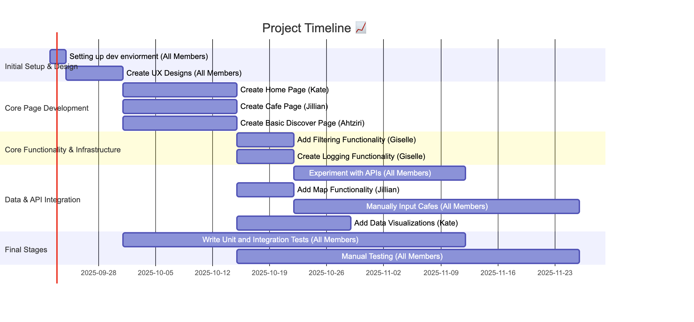

## 4.4 Schedule

This section provides schedule information for the **fika** project.

---

### 4.4.1 PERT Chart or GANTT Chart
**GANTT Chart**

****

---

### 4.4.2 Task/Resource Table

This table details the relationship between each task and the resources required to complete it. This ensures that the workload is distributed properly among team members and other resources.

| Task | Estimated Duration | Assigned To | Resources (Hardware/Software) |
|---|---|---|---|
| **Setting up dev enviorment** | 2 days | All Members | VSCode, Supabase, Vercel, GitHub, Node.js, npm |
| **Create UX Designs** | 2 weeks | All Members | Figma, Gemini mocks, Photoshop |
| **Create Home Page** | 2 weeks | Kate | Next.js, VSCode, Gemini mocks, Figma, CSS help tools |
| **Create Cafe Page** | 2 weeks | Jillian | Next.js, VSCode, Gemini mocks, Figma, UI kits |
| **Create Basic Discover Page** | 2 week | Ahtziri | VSCode, Gemini mocks, Figma |
| **Write Unit and Intergration Tests** | 6 weeks | All members | VSCode |
| **Manually Testing** | 2 weeks | All members | VSCode |
| **Add Filtering Functionality** | 2-3 days | Giselle | VSCode, Supabase |
| **Add Map Functionality** | 1 week | Jillian | OpenStreetsMap API |
| **Add Data Visualizations** | 2 weeks | Kate | Vega, VSCode |
| **Create Logging Functionality** | 1 week | Giselle | Supabase, VSCode |
| **Manually Input Cafes** | 5 weeks | All members | VSCode, Google maps, Yelp, Google |
| **Experiment with APIs** | 3 weeks | All members | OpenStreetsMap, GooglePlaces, Yelp Fusion |
